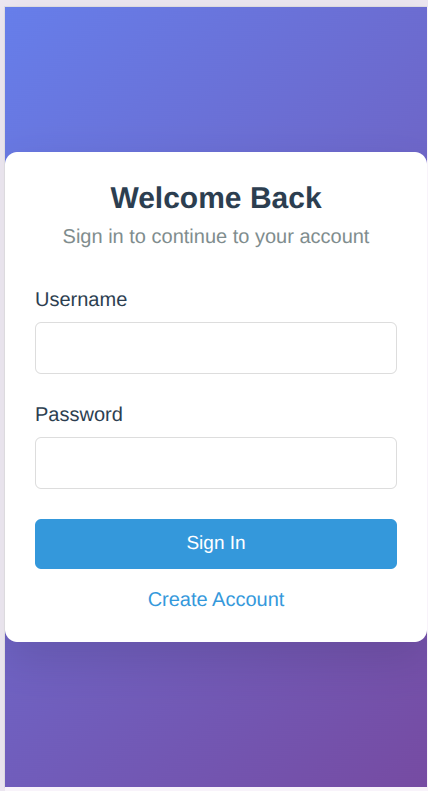
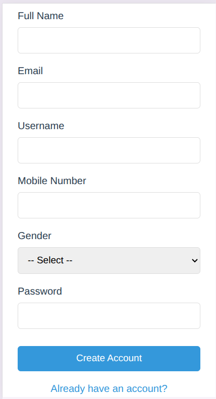
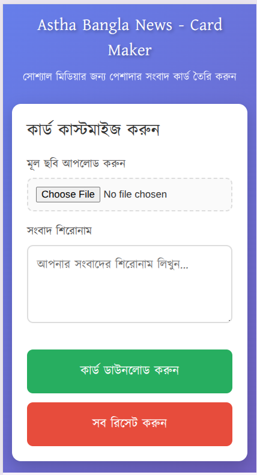
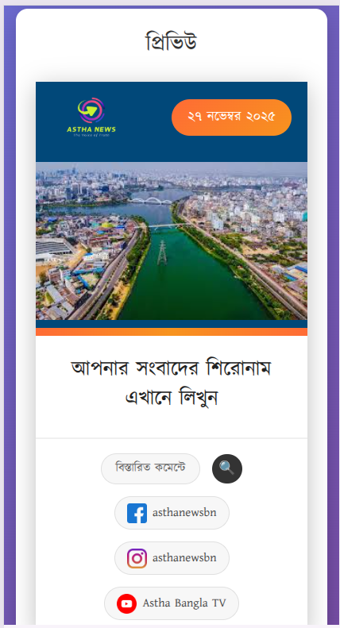

# Astha Bangla News - Card Maker

A professional Bengali news card generator for social media platforms. Create beautiful, branded news cards with custom headlines, images, and automatic date formatting in Bengali. Perfect for journalists, news agencies, and content creators.

## Screenshots

### Home Page


### Login & Registration
<p align="center">
  
  
</p>

### Card Maker Tool
<p align="center">
  
  
</p>

## Features

- 📰 Create professional news cards with custom headlines
- 🖼️ Upload and preview images
- 📅 Automatic Bengali date display
- 📱 Fully responsive design
- ⬇️ Download cards as high-quality PNG images
- 🔐 Simple authentication system

## Demo Credentials

- **Username:** admin
- **Password:** admin

## Pages

- **index.html** - Home page with news grid
- **login.html** - Login page
- **register.html** - Registration page
- **photocard.html** - Main card maker tool

## Technologies Used

- HTML5
- CSS3 (Responsive Design)
- JavaScript
- html2canvas library
- Kalpurush Bengali font

## Installation

1. Clone this repository:
```bash
git clone https://github.com/YOUR-USERNAME/astha-bangla-news.git
```

2. Navigate to the project folder:
```bash
cd astha-bangla-news
```

3. Open `index.html` in your browser or use a local server.

## Usage

1. Navigate to the login page
2. Enter credentials (admin/admin)
3. Upload an image for your news card
4. Enter your headline in Bengali
5. Preview the card
6. Download as PNG

## File Structure
```
├── index.html          # Home page
├── login.html          # Login page
├── register.html       # Registration page
├── photocard.html      # Card maker tool
├── images/             # Logo and social media icons
│   ├── logo.png
│   ├── facebook.png
│   ├── instagram.png
│   └── youtube.png
├── report/        # Project screenshots
│   ├── puc_logo.png
│   ├── report.tex     #La-Tex format of Report
│   ├── Project_Report.pdf
│   ├── screenshot_home.png
│   ├── screenshot1.png
│   ├── screenshot2.png
│   ├── screenshot3.png
│   └── screenshot4.png
└── README.md           # This file
```

## Browser Support

- Chrome (recommended)
- Firefox
- Safari
- Edge

## License

© 2025 Astha Bangla News. All rights reserved.

## Contributing

Pull requests are welcome. For major changes, please open an issue first to discuss what you would like to change.

## Contact

For any queries, reach out through:
- Facebook: asthanewsbn
- Instagram: asthanewsbn
- YouTube: Astha Bangla TV
